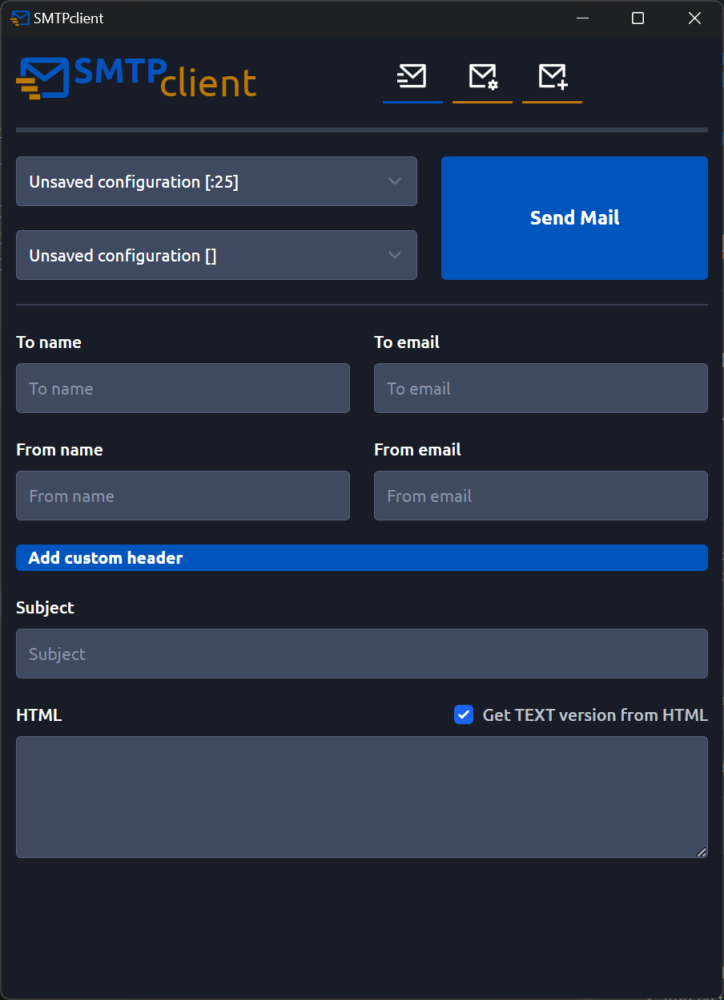
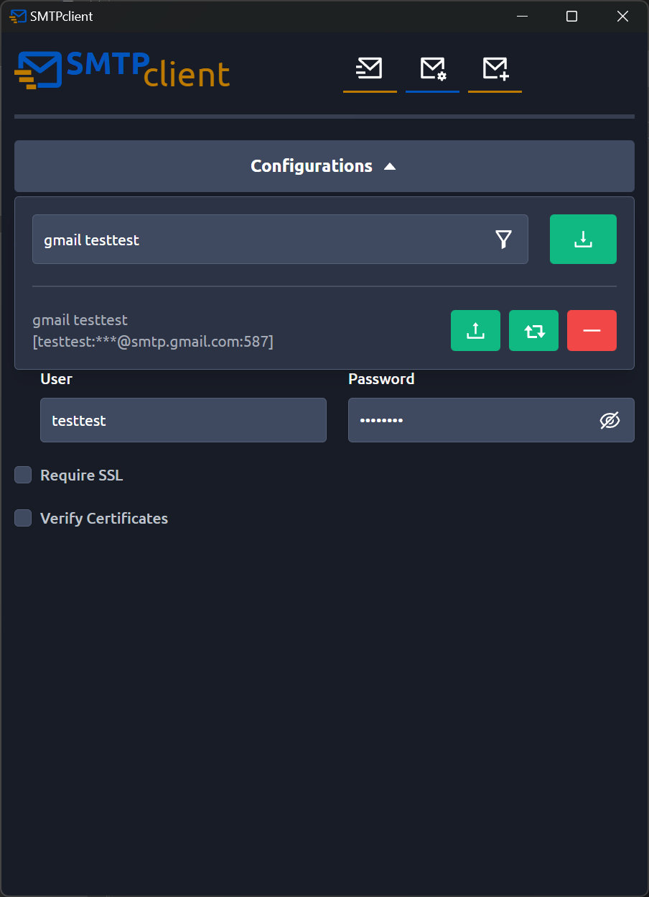

<br/>


[](https://github.com/MoQuEs/smtp_client/tree/main)
[](https://github.com/MoQuEs/smtp_client/tree/develop)

[](https://github.com/MoQuEs/smtp_client/releases)
[](https://github.com/MoQuEs/smtp_client/releases)
[](https://github.com/MoQuEs/smtp_client/actions/workflows/release.yml)

- [Changelog](CHANGELOG.md)
- [Roadmap](ROADMAP.md)

---

## Introduction
SMTPclient is a simple gui smtp client, mainly used for testing smtp servers and send simple mails





## Development

### Requirements
#### Main
- rust >= 1.66.0
- node >= 18.16.0

#### Additional tools to install
```bash
cargo install typeshare-cli
cargo install cargo-bump
```

#### Run locally
```bash
npm run tauri dev
```

#### Build locally
```bash
npm run tauri build
```

#### Scripts
- `npm run check` - Run check on frontend
- `npm run format` - Reformat whole project
- `npm run logo <logo_image_name_in_logo_folder>` - Run generator on logo to generate icons
- `npm run prepare_release <sver_version_to_prepare>` - Will bump version in:
  - `package.json` - frontend
  - `cargo.toml` - backend
  - `src-tauri/tauri.conf.json` - build script
  - `CHANGELOG.md` - will change `Unreleased` to set version
